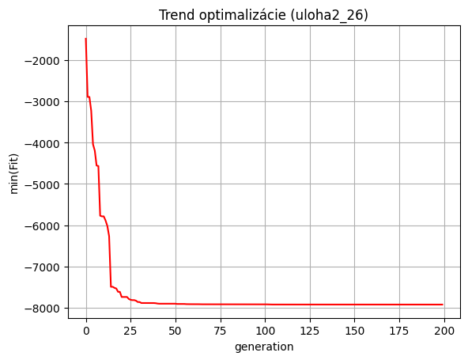

# UMINT-GA

[Google Colab - Python](https://colab.research.google.com) 

[Test function 3 C ](/Kod/testfn3c.py)

[Jupyter Notebook template](/Kod/UMINT_BLOK_1.ipynb)

[Genetic Toolbox Manual](/Kod/prirucka_genetic_all.pdf)

# Zadania
* [ZADANIE Č.1: Horolezecký algoritmus – Hľadanie globálneho minima Hill Climbing Algorithm](/Zadania/umint_zad1.pdf)

* [ZADANIE Č.2: Genetický algoritmus – Hľadanie globálneho minima](/Zadania/umint_zad2.pdf)

* [ZADANIE Č.3: Genetický algoritmus – Riešenie úlohy obchodného cestujúceho](/Zadania/)

* [ZADANIE Č.4: Genetický algoritmus – Alokácia investícií do finančných produktov](/Zadania/)

* [ZADANIA Č.1-4: pptx](/Zadania/UI_26_ulohy1234_navod_2.pdf)

# Result:
## Zad. 2:

F_optimal = -7926.743915533909 (theoretical: −7927.2)

---
## Zad. 3:
F_optimal = 483.1012838366593