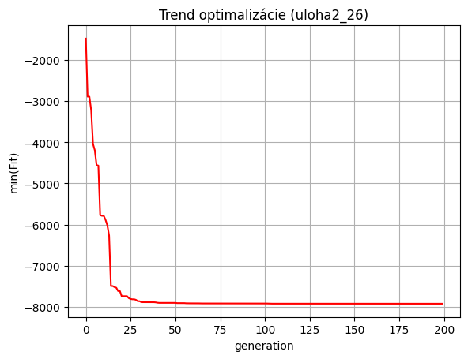
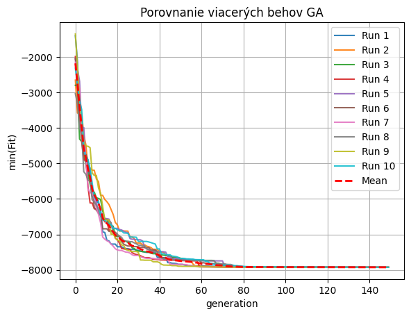
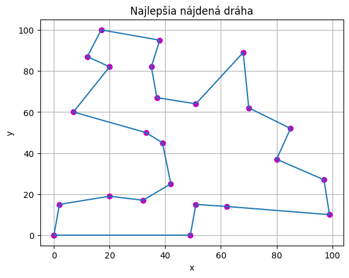

# UMINT-GA

[Google Colab - Python](https://colab.research.google.com) 

[Test function 3 C ](/Kod/testfn3c.py)

[Jupyter Notebook template](/Kod/UMINT_BLOK_1.ipynb)

[Genetic Toolbox Manual](/Kod/prirucka_genetic_all.pdf)

# Zadania
* [ZADANIE Č.1: Horolezecký algoritmus – Hľadanie globálneho minima Hill Climbing Algorithm](/Zadania/umint_zad1.pdf)

* [ZADANIE Č.2: Genetický algoritmus – Hľadanie globálneho minima](/Zadania/umint_zad2.pdf)

* [ZADANIE Č.3: Genetický algoritmus – Riešenie úlohy obchodného cestujúceho](/Zadania/umint_zad3.pdf)

* [ZADANIE Č.4: Genetický algoritmus – Alokácia investícií do finančných produktov](/Zadania/umint_zad4.pdf)

* [ZADANIA Č.1-4: pptx](/Zadania/UI_26_ulohy1234_navod_2.pdf)


# Result:
## Zad. 2:
```
F_optimal = -7926.743915533909 (theoretical: −7927.2)
```


### multi run:
```
Finálna fitness pre jednotlivé behy:
Run 1: F = -7926.498226349376
Run 2: F = -7926.244804306843
Run 3: F = -7926.279954574553
Run 4: F = -7925.8573555555495
Run 5: F = -7926.644247081488
Run 6: F = -7925.442941352927
Run 7: F = -7925.994256670805
Run 8: F = -7926.859171708871
Run 9: F = -7926.70028030762
Run 10: F = -7926.207381133421

Priemerná finálna fitness:
-7926.272861904146
```



---
## Zad. 3:
```
F_optimal = 483.1012838366593
```


### multi run:
```
Run 1: F = 477.1801012610535
Run 2: F = 477.2181598746912
Run 3: F = 490.09110753819635
Run 4: F = 472.584862129655
Run 5: F = 472.584862129655
Run 6: F = 536.1038400017218
Run 7: F = 468.10945248384104
Run 8: F = 476.6712414517133
Run 9: F = 491.3398121445869
Run 10: F = 472.584862129655

Najlepšie globálne riešenie:
Run = 7
F_best = 468.1095
Cesta = [...]
Under 480 = 7  (70.0%)
```


---
---

```
Run 1: F = 492.2640982622813
Run 2: F = 482.23110475373676
Run 3: F = 482.23110475373676
Run 4: F = 468.10945248384104
Run 5: F = 472.584862129655
Run 6: F = 468.10945248384104
Run 7: F = 501.38515522210145
Run 8: F = 473.76136597413375
Run 9: F = 473.76136597413375
Run 10: F = 490.09110753819635

Najlepšie globálne riešenie:
Run = 4
F_best = 468.1095
Cesta = [...]
Under 480 = 5  (50.0%)
```

